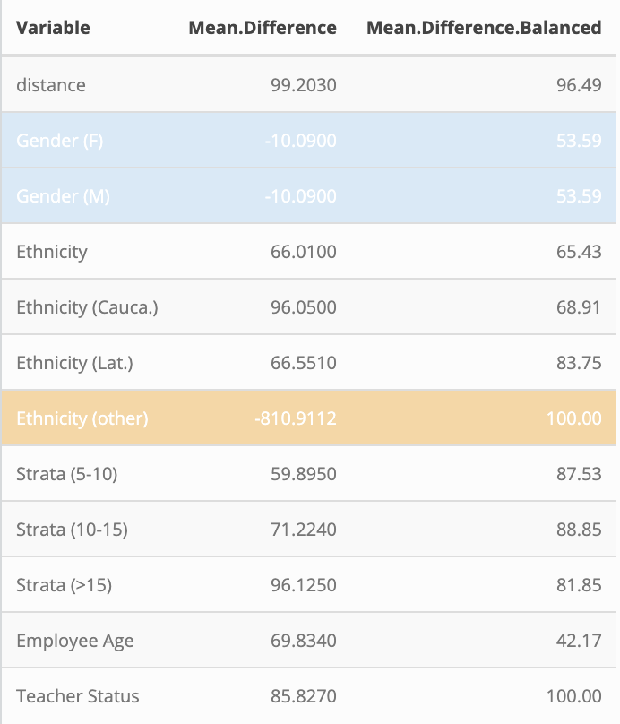

## Overview

---


<p>In experiments where randomization is not feasible, propensity score matching helps to control for confounded relationships. Analysts working in this causal framework often run into a particular issue: sample size affects their ability to arrive at evenly matched samples. This problem is especially prevalent in observational studies which use administrative data. In a project with the Philadelphia School District, we arrive at better percent balance improvement by trimming mis-represented groups. </p>


```{r, out.width=600, echo=F}

```


#### First

The original dataset contained 2119 entries of patients and 18 variables. Multiple variables contained missing values. The sex variable included 230 missing values. In order to keep the information that would be lost if list wise deletion were employed, I coded these values as “absent”. Likewise, I recode the order variable with 4, the most common present order, if missing. For variables missing the age, values of 25 were imputed in missing values, since 25 was the most frequently observed age, and the provided variable does not give insight into the distribution of ages between decades. After this recoding, 2 variables remained missing from the outcome of interest, the State 3 variable. Looking into these two variables, both their State 2 values were “Lived”, so I recode State 3 to released for these two observations. Limitations to this approach of recoding are that the values imputed could stray from the true values of these variables, and that something explaining the missingness could contribute to the outcomes for these observations.
In choosing the predictors for the final model, the birth year variable, which is already captured in the age variable is left out of the model. Additionally, the country variable, which only 12 values are from outside Korea is left out of the analysis data set, since, with such a small number outside of Korea, no cases may end up being sampled in the random forest. Likewise, dates of infection and symptom onset, with no knowledge of how the data were collected could be subject to much bias, and these are left out. The final random forest model includes the predictors Order, Sex, Province, Age, and confirmed date.


## Data

* Data kept private due to NDA

##### Technical
Data cleaning: tidyverse </br>
Text Analysis: tidytext

## Cleaning Notes
The original dataset contained 2119 entries of patients and 18 variables. Multiple variables contained missing values. The sex variable included 230 missing values. In order to keep the information that would be lost if list wise deletion were employed, I coded these values as “absent”. Likewise, I recode the order variable with 4, the most common present order, if missing. For variables missing the age, values of 25 were imputed in missing values, since 25 was the most frequently observed age, and the provided variable does not give insight into the distribution of ages between decades. After this recoding, 2 variables remained missing from the outcome of interest, the State 3 variable. Looking into these two variables, both their State 2 values were “Lived”, so I recode State 3 to released for these two observations. Limitations to this approach of recoding are that the values imputed could stray from the true values of these variables, and that something explaining the missingness could contribute to the outcomes for these observations.
In choosing the predictors for the final model, the birth year variable, which is already captured in the age variable is left out of the model. Additionally, the country variable, which only 12 values are from outside Korea is left out of the analysis data set, since, with such a small number outside of Korea, no cases may end up being sampled in the random forest. Likewise, dates of infection and symptom onset, with no knowledge of how the data were collected could be subject to much bias, and these are left out. The final random forest model includes the predictors Order, Sex, Province, Age, and confirmed date.

## Packages

* [MatchIt](https://cran.r-project.org/web/packages/MatchIt/index.html)


</div>
<div class="col-sm-6">


</div>
<div class="col-sm-6">
<script>
$(document).ready(function(){
    $('[data-toggle="popover"]').popover(); 
});
</script>
```{r eval=FALSE, message=FALSE, include=FALSE}
set.seed(1731)
# trimming the sample
analysis_data_trimmed <- analysis_data %>%
  filter(YearsOfService %in% c(0:31, 33,34,35,36,37,39))
nearest <- matchit(Participated ~
                     Gender+ Ethnicity + Strata + employeeage+ title_status
                     ,
                   family = "binomial",
                   method = "nearest",
                   caliper = 0.25,
                   data = analysis_data_trimmed)
summary(nearest)
###plotting these
plot(nearest)
nearest_matched <- match.data(nearest)
#now perform the statistical analysis
nearest_matched$Participated <- as.factor(nearest_matched$Participated)
model <- glm(Retained ~ Participated, data = nearest_matched,
             family = binomial)
summary(model)
```
## Logistic Regression

Participating in TIP is associated with an increase in the log odd likelihood of retention. Specifically, the coefficient was .35, meaning that participating in TIP was associated with a .35 increase in retention.

## Causal Analysis

* We match teachers based on available and measured covariates, such as years in the classroom, gender, or title (classroom teacher or administration). By matching, we reduce the chance that these factors (whether or not the teacher is a male or female, for instance) explain retention. Instead, the variable of causal interest (whether or not the teacher participated in the intervention) is isolated.
* We spent ample time exploring the differences in groups for each measured covariates, since the goal of balancing will depend on the raw differences in the sample size representation of each of these covariates. Appendix A includes differences in covariate groups among TIP and non-TIP teachers. The impacts of each covariate on the percent balance improvement among TIP and non-TIP teachers was considered, and in the end we chose to trim the sample to include only the ages of teachers who participated in TIP. To be more specific, certain ages of teachers are represented in the non-TIP sample, yet not represented in the Treatment (TIP) sample. The ages that are not represented in the TIP samples are: 32, 38, and 40+. Especially in the context of our study, where the question of interest is teacher retention, then an important confounder of staying in the classroom is age of the teacher. Therefore, matching on age without taking into account these non-representative ages may affect the balance allowed on other variables (specifically gender and ethnicity). 300 non-participating teachers were not matched in the age of the TIP participating teachers. </br>
* Trimming the sample has the effect of improving percent balance improvement for Gender and the other category of Ethnicity. In fact, all of the variables now have sufficient percent balance improvement. Appendix A includes the original matching model with all covariates included, and describes how the percent balance improvement informed the selection of covariates in our final matching model, presented below. This final model includes the trimmed TIP sample so
that we only include TIP teachers with Years of experience that are matched in the other sample of non-TIP teachers.


```{r, out.width=300, echo=F}

```


## Takeaways

* Teacher
retention is a much studied topic , and programs like TIP, which enable teachers to pursue
university-level study, thereby bringing new content to students and increasing teachers’ morale, are rooted in the mission to keep teachers helping those students who need them most. Both authors of this study were public school teachers themselves, and know that “intellectual engagement” is certainly as important as “purpose” in a career. One possible explanation behind the increased retention of teachers who participate in TIP may by this intellectual engagement that the program offers.
* There remains unanswered questions in this domain that the TIP organization can continue to pursue and work to address. Specifically, what are the outcomes of teachers who do leave the district, after participating in TIP? Our study was limited to a binary variable of retained or not retained. This lacks a very important other possibility, which is that teachers left their role in SDP to pursue other intellectually engaging and purpose driven opportunities, such as a doctorate in education or starting their own computer programming boot-camp for minority students in Philadelphia. It is hard to argue that these teachers are contributing to educational inequity by leaving their classroom positions. TIP can continue to reach out to teachers who leave to learn qualitatively about the specifics of roles that former teachers are pursuing outside of the classroom role, and whether or not participating in TIP actually encouraged them to seek these roles that are equally as influential as the work of a classroom teacher.